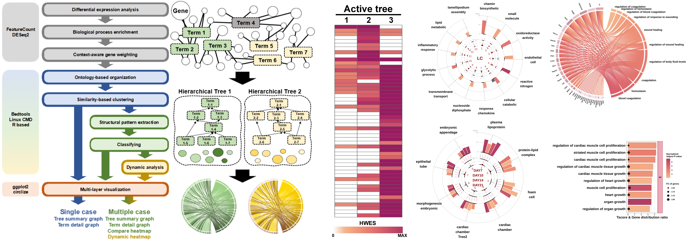

<<<<<<< HEAD
# MANGO: Multi-case Active oNtology-based GO organizer
MANGO is an R package for Gene Ontology (GO) Biological Process enrichment analysis that reduces redundancy in top-ranked results by restructuring enriched terms into ontology-guided term trees based on the GO DAG. It defines and filters active trees using coverage/consistency criteria to suppress structurally driven false positives arising from hierarchical dependencies. MANGO supports single- and multiple- case study designs by integrating enrichment outputs across conditions, providing scoring options and visualization utilities to summarize common and condition-specific biological processes. Optional features include ORA-style soft filtering and fold-change-aware weighting for tree and term prioritization.


>- **Problem:** GO Biological Process enrichment results are often dominated by biologically similar top terms, and GO’s hierarchical DAG + gene sharing can create **structural false positives**, reducing interpretability and confidence.
>- **Solution (MANGO):** An analytical framework that reorganizes GO outputs into **ontology-informed term trees** and applies **structural filtering** based on **within-tree consistency**.
>- **Key idea 1 — Tree organizing:** MANGO groups similar terms into trees to reduce redundancy and compress results into interpretable units.
>- **Key idea 2 — Active-tree filtering:** MANGO suppresses isolated, single-term–driven signals using an **active-tree criterion**.
>- **Multiple-case support:** MANGO aligns results from multiple comparisons into a **shared tree structure** and classifies **common vs condition-specific** trees using **HWES** and relative signal strength across conditions.
>- **Parameter recommendations:** A parameter search provides **input-size–specific recommended settings**.
>- **Benchmarking:** Evaluated across **31 single-case analyses** against **ORA** and **GSEA** using **adjusted p-values**, **fraction of terms assigned**, and **rich factors** to assess interpretability.
>- **Validation:** Demonstrated reproduction of reported signals across public datasets spanning **knockout**, **cancer**, **differentiation**, **dose–response**, and **cohort** designs.
>- **Usability:** Provides **R-based visualization functions** for both single- and multiple-case settings to aid interpretation.
>- **Take-home:** MANGO reduces redundancy and structural false positives driven by the GO DAG, enabling **reproducible term-pattern summarization** for multi-comparison studies.

## Installation

### Linux / macOS (terminal)

```bash
mkdir -p GO_BB_dirpath
wget -O GO_BB_dirpath/GO_BB.tar.gz https://github.com/user-attachments/files/25747922/GO_BB.tar.gz
tar -xzf GO_BB_dirpath/GO_BB.tar.gz -C GO_BB_dirpath
```

### R


```r
# install.packages("remotes")
remotes::install_github("ERASMUSlab/MANGO")
```

## Documentation

Full documentation and tutorials:
https://erasmuslab.github.io/MANGO


## Citation

If you use MANGO in your research, please cite:
https://erasmuslab.github.io/MANGO/authors.html#citation
=======


<!-- README.md is generated from README.Rmd. Please edit that file -->

# MANGO

<!-- badges: start -->

<!-- badges: end -->

The goal of MANGO is to …

## Installation

You can install the development version of MANGO like so:

``` r
# FILL THIS IN! HOW CAN PEOPLE INSTALL YOUR DEV PACKAGE?
```

## Example

This is a basic example which shows you how to solve a common problem:

``` r
library(MANGO)
## basic example code
```

What is special about using `README.Rmd` instead of just `README.md`?
You can include R chunks like so:

``` r
summary(cars)
#>      speed           dist       
#>  Min.   : 4.0   Min.   :  2.00  
#>  1st Qu.:12.0   1st Qu.: 26.00  
#>  Median :15.0   Median : 36.00  
#>  Mean   :15.4   Mean   : 42.98  
#>  3rd Qu.:19.0   3rd Qu.: 56.00  
#>  Max.   :25.0   Max.   :120.00
```

You’ll still need to render `README.Rmd` regularly, to keep `README.md`
up-to-date. `devtools::build_readme()` is handy for this.

You can also embed plots, for example:


In that case, don’t forget to commit and push the resulting figure
files, so they display on GitHub and CRAN.
>>>>>>> fb78252... WIP: local changes
