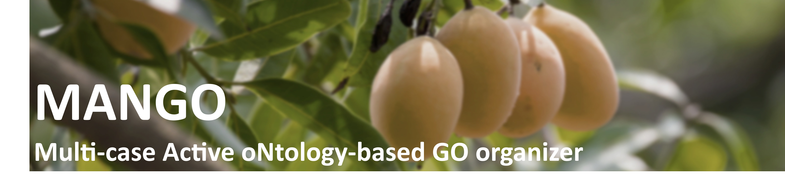

## **MANGO**

MANGO is an R package for Gene Ontology (GO) Biological Process (BP)
enrichment analysis that helps reduce redundancy and improve
interpretability of top-ranked results. Instead of reporting long lists
of highly overlapping terms, MANGO restructures enriched terms into
**ontology-guided term trees** using the GO DAG, enabling compact
summaries of biological signals.

This release provides the following key features:

- **Ontology-based structuring to reduce redundant top terms:**\
  MANGO reorganizes enriched BP terms into tree-structured groups based
  on GO hierarchy and term relationships, helping prevent near-duplicate
  terms from dominating the top ranks.

- **Active-tree filtering to suppress structural false positives:**\
  Because GO is hierarchical, significant-looking terms can appear due
  to dependency rather than true signal. MANGO defines and filters
  **active trees** using coverage/consistency criteria (e.g., hit-term
  count and hit ratio) to downweight structurally driven results.

- **Single-case and multiple-case workflows:**\
  MANGO supports both single-condition summaries and **multiple-case
  designs** by integrating enrichment outputs across conditions. This
  enables discovery of **common vs condition-specific** biological
  processes and facilitates trend/pattern interpretation across dose,
  time-course, or cohort comparisons.

- **Visualization utilities for tree-level interpretation:**\
  MANGO provides plotting functions to summarize active trees and
  term–gene relationships, including single- and multiple-case views for
  interpretation and reporting.

Install:
[Install](https://erasmuslab.github.io/MANGO/articles/MANGO-install.md)

Data Preprocessing & Analysis: [Single case & Multiple
case](https://erasmuslab.github.io/MANGO/articles/MANGO-intro.md)

Visualization: [Single case & Multiple
case](https://erasmuslab.github.io/MANGO/articles/MANGO-intro.md)
